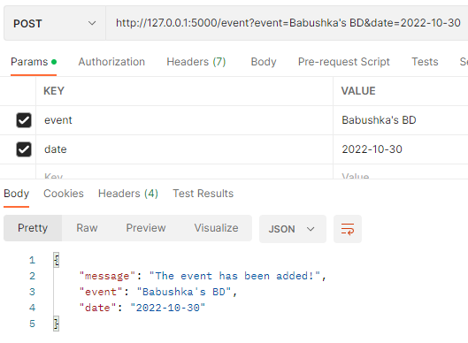

# CalendarAPI

## API for keeping all your tasks and events for days!

### YOU can ADD EVENTS
 
### and then VIEW THEM!

#### ALL at ONCE

#### in RANGE

#### TODAY's events

#### AND even BY ID

## If you forgot how to use the API,  use MANUAL ON MAIN PAGE

.

.

Project by Ivan Malakhov
